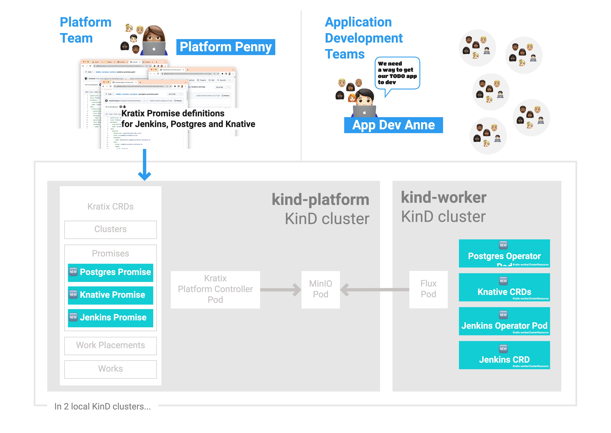
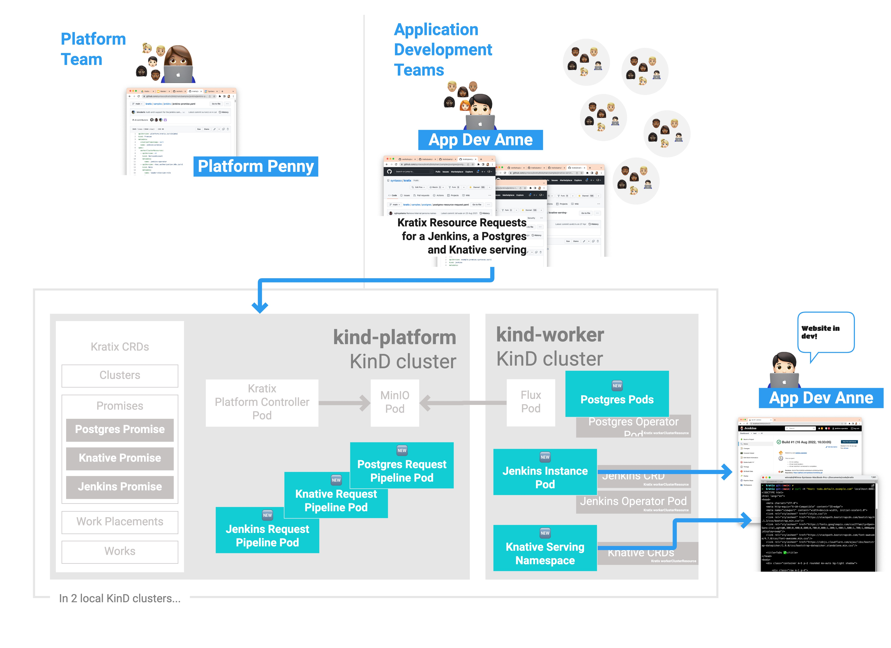

This is Part 3 of [a series](../README.md) illustrating how Kratix works. <br />
👈🏾&nbsp;&nbsp; Previous: [Install a Kratix Promise](/installing-a-promise/) <br />
👉🏾&nbsp;&nbsp; Next: [Writing and installing a Kratix Promise](/writing-a-promise/)

<hr>

### In this tutorial, you will
1. [learn more about the power of Promises](#power-of-promises)
1. [use Kratix Promises to build a paved path](#deploy)

# <a name="power-of-promises"></a> The power of Promises

As covered previously, Promises are the building blocks that enable teams to design platforms that specifically meet their customer needs. Through writing and extending Promises, Platform teams can raise the value line of the platform they provide. They can use multiple simpler, low-level Promises to provide an experience tailored to their users needs.

Consider the task of setting up development environments for application teams. This task is usually repetitive and requires many cookie-cutter steps. It may involve wiring up Git repos, spinning up a CI/CD server, creating a PaaS to run the applications, instructing CI/CD to listen to the Git repos and push successful builds into the PaaS, and finally wiring applications to their required data services.

A Promise can encapsulate all the required steps and handle the toil of running those low-level tasks. It can be designed as a single Promise that does it all, or it can be a collection of Promises that, combined, deliver the desired functionality.

Now you will see the power of Kratix Promises by deploying a web app that uses multiple Promises.

<br />
<hr>
<br />

## <a name="deploy"></a> Building a paved path using multiple Kratix Promises



### Steps
1. [Complete pre-requistes](#prerequisites), if required
1. [Install Promises](#install-all-promises)
1. [Request instances](#request-instances)
1. [Run the deploy pipeline](#deploy-pipeline)
1. [Test the application](#test-app)
1. [Summary](#summary)
1. [Tear down your environment](#teardown)

### <a name="prerequisites"></a>Pre-requisites

You need a fresh installation of Kratix for this section. The simplest way
to do so is by running the quick-start script from within the Kratix
directory:

```bash
cd /path/to/kratix
./scripts/quick-start.sh --recreate
```

Alternatively, you can go back to the first step on this series: [Install Kratix across two KinD clusters](/installing-kratix/).

### <a name="install-all-promises"></a>Install all required Promises

In order for an application team to deploy an application to a dev environment they require a relational datastore (postgres), networking for user traffic (Knative), and a CI/CD service for ongoing improvements (Jenkins). To deliver this functionality on-demand with Kratix install the required Promises on your platform cluster:

<!-- ❓ Do we want people to clone the workshop and kratix or not? -->
```console
kubectl --context kind-platform apply --filename https://raw.githubusercontent.com/syntasso/kratix/main/samples/postgres/postgres-promise.yaml
kubectl --context kind-platform apply --filename https://raw.githubusercontent.com/syntasso/kratix/main/samples/knative-serving/knative-serving-promise.yaml
kubectl --context kind-platform apply --filename https://raw.githubusercontent.com/syntasso/kratix/main/samples/jenkins/jenkins-promise.yaml
```
<br />

Verify the Promises are all installed on your platform cluster
```console
kubectl --context kind-platform get promises
```
<br />

The above command will give an output similar to
```console
NAME                      AGE
ha-postgres-promise       1m
jenkins-promise           1m
knative-serving-promise   1m
```
<br />

Verify the `workerClusterResources` (more details in future steps) are installed on your worker cluster<br/>
<sub>(This may take a few minutes so `--watch` will watch the command)</sub>
```console
kubectl --context kind-worker get pods --watch
```
<br />

The above command will give an output similar to
```console
NAME                                 READY   STATUS    RESTARTS   AGE
jenkins-operator-6c89d97d4f-r474w    1/1     Running   0          1m
postgres-operator-7dccdbff7c-2hqhc   1/1     Running   0          1m
```
<br />

### <a name="request-instances"></a>Request instances



Submit a set of Kratix Resource Requests to get a Knative Serving component, a Jenkins instance and a Postgres database.
```console
kubectl --context kind-platform apply --filename https://raw.githubusercontent.com/syntasso/kratix/main/samples/postgres/postgres-resource-request.yaml
kubectl --context kind-platform apply --filename https://raw.githubusercontent.com/syntasso/kratix/main/samples/knative-serving/knative-serving-resource-request.yaml
kubectl --context kind-platform apply --filename https://raw.githubusercontent.com/syntasso/kratix/main/samples/jenkins/jenkins-resource-request.yaml
```
<br />

By requesting these three resources, you will start three pods, one for the Jenkins server (named `jenkins-example`), and two which create a postgres cluster (named per the Resource Request name, `acid-minimal`). To verify you have all the necessary resources up and running<br/>
<sub>(This may take a few minutes so `--watch` will watch the command)</sub>
```console
kubectl --context kind-worker get pods --watch
```
<br />

The above command will give an output similar to
```console
NAME                                      READY   STATUS    RESTARTS         AGE
acid-minimal-cluster-0                    1/1     Running   0                5m
acid-minimal-cluster-1                    1/1     Running   0                5m
jenkins-example                           1/1     Running   0                5m
...
```
<br />

Verify that knative has also installed its networking resources into two new namespaces 
```console
kubectl --context kind-worker get namespaces
```
<br />

The above command will give an output similar to
```console
NAME                   STATUS   AGE
knative-serving        Active   1h
kourier-system         Active   1h
...
```
<br />

Verify that the Kratix Resource Request was issued on the platform cluster.
```console
kubectl get jenkins.example.promise.syntasso.io
```
<br />

The above command will give an output similar to
```console
NAME          AGE
example       1m
```
<br />

Verify the instance is created on the worker cluster<br/>
<sub>(This may take a few minutes so `--watch` will watch the command)</sub>
```console
kubectl get pods --namespace default --context kind-worker --watch
```
<br />

The above command will give an output similar to
```console
NAME                                READY   STATUS    RESTARTS   AGE
jenkins-example                     1/1     Running   0          1m
jenkins-operator-7886c47f9c-zschr   1/1     Running   0          10m
```
<br />

#### <a name="deploy-pipeline"></a>Run the application deploy pipeline

With all the necessary resources available, you will now change hats to be a part of the application team who can now design and run their own CI/CD pipeline using the provided Jenkins service.

Access the Jenkins UI in a browser, as in the [previous step](/installing-a-promise/README.md).

<br />

Port forward for browser access to the Jenkins UI 
```console
kubectl --context kind-worker port-forward jenkins-example 8080:8080
```
<br />

Navigate to http://localhost:8080 and log in with the credentials you copy from the below commands.

<br />

Copy and paste the Jenkins username into the login page
```console
kubectl --context kind-worker get secret jenkins-operator-credentials-example --output 'jsonpath={.data.user}' | base64 --decode
```
<br />

Copy and paste the Jenkins password into the login page
```console
kubectl --context kind-worker get secret jenkins-operator-credentials-example --output 'jsonpath={.data.password}' | base64 --decode
```
<br />

In the Jenkins UI, create a new pipeline using this
[Jenkinsfile](https://raw.githubusercontent.com/syntasso/workshop/main/sample-todo-app/ci/Jenkinsfile)
and execute it.

For those that are less familiar with Jenkins, you can watch this video to see how to navigate the UI for this task.

https://user-images.githubusercontent.com/201163/175933452-853af525-7fff-4dca-9ba9-032c07c8c393.mov

<br />

### <a name="validate-deployment"></a>Validate the deployment

Verify that the Knative Service for the application is ready:

```console
kubectl --context kind-worker get services.serving.knative.dev
```
<br />

The above command will give an output similar to
```console
NAME   URL                               LATESTCREATED   LATESTREADY   READY   REASON
todo   http://todo.default.example.com   todo-00001      todo-00001    True
```
<br />

### <a name="test-app"></a>Test the deployed application

Now test the app. 

On a separate terminal, you'll need to open access to the app by port-forwarding the kourier service:

```console
kubectl --context kind-worker --namespace kourier-system port-forward svc/kourier 8081:80
```
<br />

Now curl the app:
```console
curl -H "Host: todo.default.example.com" localhost:8081
```
<br />


## <a name="summary"></a>Summary
Your platform has pieced together three different Promises to provide a complete solution for an application team to deploy a new service to dev using your suggested CI/CD and hosting solutions. Well done!

To recap the steps we took:
1. ✅&nbsp;&nbsp;Installed all three Kratix Promises
1. ✅&nbsp;&nbsp;Requested an instance of each Kratix Promise
1. ✅&nbsp;&nbsp;Created and run a CI/CD pipeline for a new application
1. ✅&nbsp;&nbsp;Viewed an endpoint from a newly deployed and networked application

This is only the beginning of working with Promises. Next you will learn how to write and update Promises, and in the final thoughts we will showcase the composability of Promises to further optimise this workflow from three requests down to one.

## <a name="teardown"></a>Tearing it all down

The next section in this tutorial requires a clean Kratix installation. Before heading to it, please clean up your environment by running:

```bash
kind delete clusters platform worker
```
<br />

### 🎉 &nbsp; Congratulations!
✅&nbsp;&nbsp; You have deployed a web app that uses multiple Kratix Promises. <br />
👉🏾&nbsp;&nbsp; Now you will [write your own Jenkins Promise to learn more about how Kratix Promises work](/writing-a-promise/README.md).
